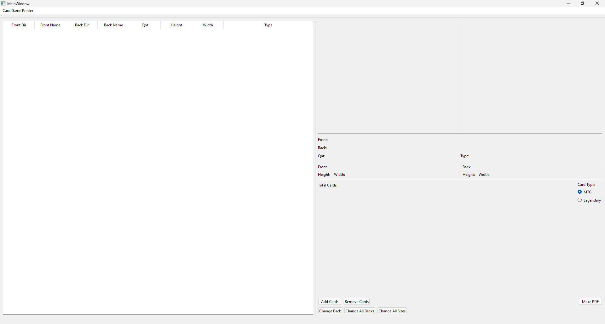
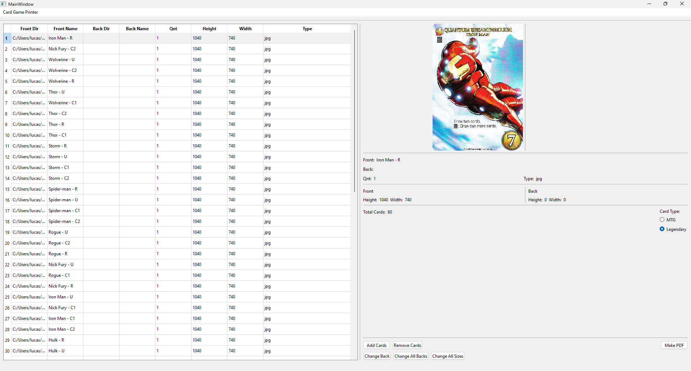
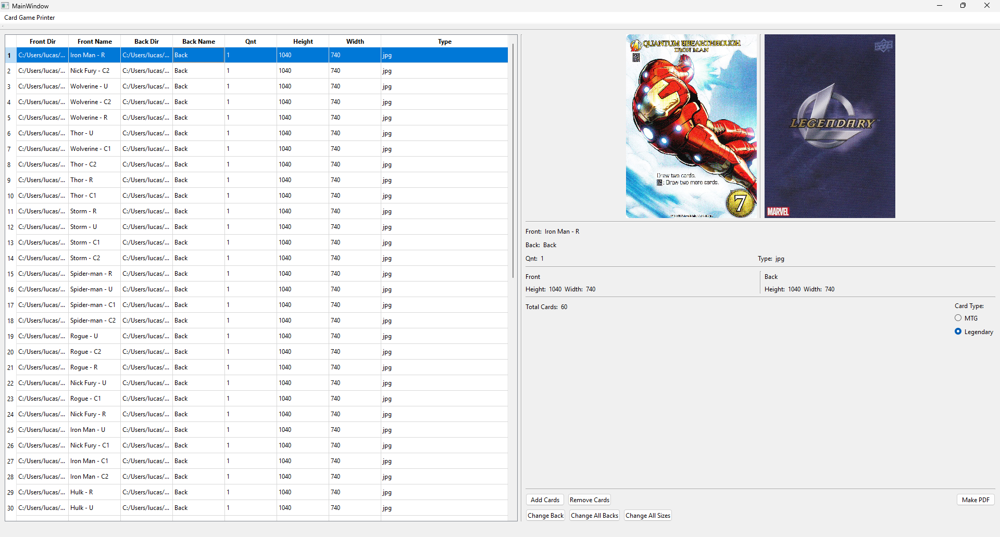
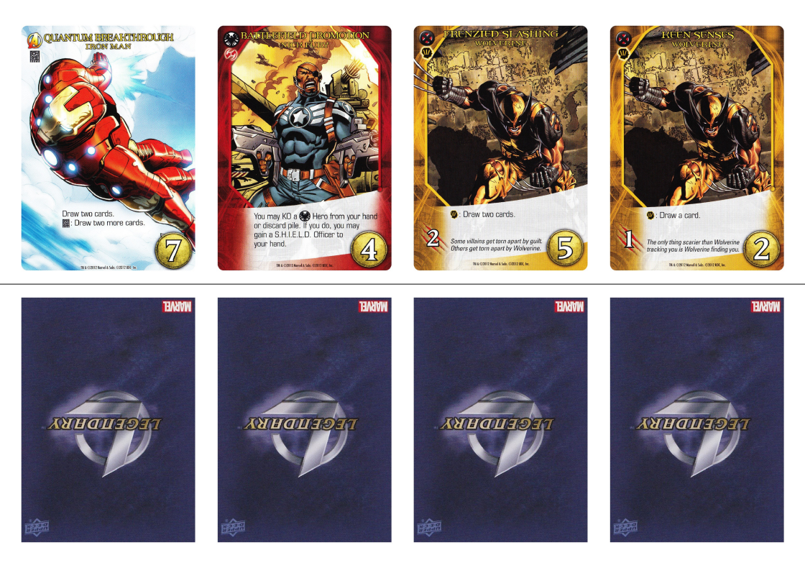

## Card Game Printer

Card Game Printer is a small Windows desktop application that helps you turn card images into a ready‑to‑print PDF.  
It is designed for printing custom cards for board games and card games at home, with fronts and backs aligned so you can cut and/or fold them cleanly.

This repository currently ships the compiled application (`Card_Printer.exe`) together with the Qt runtime libraries it needs.  
No installation is required: just download, unzip, and run.

---

### Features

- **Add multiple card fronts at once** from your image folders (JPEG supported).
- **Editable card list**: change quantities, image paths, and sizes directly in the table.
- **Shared card back**:
  - `Change Back` to set a back image for the selected cards.
  - `Change All Backs` to set the same back for every card in the list.
- **Automatic size adjustment** with `Change All Sizes` to keep the aspect ratio of your images consistent.
- **Card size presets**:
  - `MTG` – Magic‑style card size.
  - `Legendary` – Legendary Deck‑Building Game card size.
- **PDF export** that lays out fronts on one half of the page and backs on the other half, with a guide line between them so you can fold or cut accurately.

---

### Requirements

- **Operating System**: Windows 10 or later (64‑bit recommended).
- **Files included in the repo**:
  - `Card_Printer.exe`
  - Qt runtime DLLs (`Qt6Core.dll`, `Qt6Gui.dll`, `Qt6Widgets.dll`, `Qt6Svg.dll`, etc.)
  - Qt plugin folders: `platforms/`, `imageformats/`, `styles/`

All of these files must stay in the same directory for the application to start correctly.

---

### Download and Run

1. Go to the GitHub repository: [LucasCollevatti/card-game-printer](https://github.com/LucasCollevatti/card-game-printer).
2. Choose one of the options:
   - **Download as ZIP**: click the green **Code** button → **Download ZIP**, then unzip it to any folder.
   - **Clone with Git**:  
     `git clone https://github.com/LucasCollevatti/card-game-printer.git`
3. After downloading/cloning, make sure all the files stay together in the same folder (do not move the DLLs or plugin folders away from `Card_Printer.exe`).
4. On Windows, **double‑click** `Card_Printer.exe` to open the application.

No additional installation, drivers, or dependencies are required beyond what is shipped in this folder.

---

### User Interface Overview

The main window is split into three main areas:

- **Overall UI – Empty project**

- **Left side – Card list table**  
  Shows one row per card. Each row contains:
  - **Front Dir** – Directory of the front image.
  - **Front Name** – File name of the front image.
  - **Back Dir** – Directory of the back image (if any).
  - **Back Name** – File name of the back image (if any).
  - **Qnt** – Quantity: how many copies of this card to print.
  - **Height** – Image height (pixels) used for layout.
  - **Width** – Image width (pixels) used for layout.
  - **Type** – Image file type (e.g. `jpg`).

- **Right side – Preview and details**  
  Shows a preview of the selected card’s **front**, and if a back is set, the **back** as well.  
  Below the preview there is a small panel summarizing information about the selected card and the **total number of cards** in the project.

- **Bottom area – Controls**  
  Contains the main action buttons (`Add Cards`, `Remove Cards`, `Change Back`, `Change All Backs`, `Change All Sizes`, `Make PDF`) and the **card size preset** radio buttons (`MTG`, `Legendary`).

You can select rows in the table to see their preview and to apply operations only to those cards.

---

### Basic Workflow

#### 1. Add card fronts

1. Launch `Card_Printer.exe`.
2. Click **`Add Cards`**.
3. In the file dialog, navigate to the folder containing your card front images.
4. Select one or more **JPEG** files (multi‑selection with `Ctrl` or `Shift` is supported).
5. Click **Open**.  
   Each selected image is added as a new row in the table.

Example of a project after adding several fronts:

You can add more cards later by clicking **`Add Cards`** again.

---

#### 2. Edit card information (optional but recommended)

The table is **editable**:

- **Change quantity**:  
  - Double‑click the **Qnt** cell for a card.  
  - Type the desired number of copies (e.g. `3`) and press **Enter**.

- **Adjust sizes**:  
  - Normally you can leave **Height** and **Width** as they are.  
  - If you need to force a specific size for a card, double‑click the cell and enter the pixel value.

- **Rename labels** (Front Name / Back Name) if you want to use more descriptive names; this does not rename the files on disk, it only affects how they are shown in the table.

---

#### 3. Set card backs

You can assign a back image to some cards or all cards.

- **Option A – Set back for selected cards**
  1. Select one or more rows in the table.
  2. Click **`Change Back`**.
  3. Choose a back image file (JPEG) in the file dialog and click **Open**.
  4. The selected rows will have their **Back Dir** and **Back Name** updated, and the preview will show both front and back.

- **Option B – Set the same back for every card**
  1. (Optional) Clear the selection so all rows are unselected.
  2. Click **`Change All Backs`**.
  3. Choose a back image file and click **Open**.
  4. Every card in the table will now share the same back image.

If you later change your mind, you can run `Change Back` or `Change All Backs` again with a different image.

Example of the UI after choosing a back for the cards:

---

#### 4. Adjust sizes (aspect ratio)

Sometimes your front and back images (or different card fronts) might have different resolutions.  
To normalize how they are laid out:

1. Click **`Change All Sizes`**.
2. The app will recalculate sizes for the cards so that the aspect ratio is consistent when printed.

This is mainly useful when your images come from different scans or sources and you want them to line up nicely on the final sheet.

---

#### 5. Choose card size preset

On the right side, there are two radio buttons under **Card Type**:

- **MTG** – Uses a size preset suitable for Magic: The Gathering–style cards.
- **Legendary** – Uses a size preset suitable for Legendary‑style cards.

These presets control how big each card will be on the PDF page.  
Pick the one that matches the game you are printing for, or whichever looks best in your tests.

---

#### 6. Generate the PDF

When you are happy with the list of cards, quantities, backs, and sizes:

1. Click **`Make PDF`**.
2. Choose a destination folder and file name for the generated PDF.
3. Confirm to save.

The resulting PDF will:

- Place **card fronts** in a row on one half of the page.
- Place the **matching backs** on the other half of the page.
- Draw a **guideline** in the middle so that you can fold or cut cleanly.

Example output page:

This format is ideal for home printing: you can print, fold along the line, glue (optional), and then cut out your cards.

---

### Tips for Best Results

- **Use consistent DPI**: Scan or export all images at the same DPI to keep physical card sizes uniform.
- **Match front and back sources**: Use backs that were scanned or exported with the same resolution as the fronts.
- **Test print first**: Print a single sheet on plain paper to verify size and alignment before doing a full print on high‑quality paper.
- **Sleeves help**: For board‑game prototypes, putting printed cards into card sleeves can hide small cutting imperfections.

---

### Troubleshooting

- **The app does not start**  
  - Make sure `Card_Printer.exe`, the Qt DLLs (`Qt6Core.dll`, `Qt6Gui.dll`, `Qt6Widgets.dll`, `Qt6Svg.dll`, etc.), and the `platforms/`, `imageformats/`, and `styles/` folders are all in the **same directory**.

- **Images appear distorted or stretched in the PDF**  
  - Try clicking **`Change All Sizes`** to normalize aspect ratios.  
  - Double‑check that the card type preset (`MTG` / `Legendary`) matches the size you want.

- **Backs are missing in the PDF**  
  - Make sure each row has a value in **Back Dir** and **Back Name**.  
  - Re‑apply backs using `Change Back` or `Change All Backs`.

---

### Development Notes

This repository contains only the compiled Windows build and its dependencies.  
If you are interested in the source code, feel free to open an issue or contact the author.

---

### License

No license has been specified yet.  
Before publishing this repository publicly, you may want to add a `LICENSE` file with your preferred open‑source or proprietary license terms.

